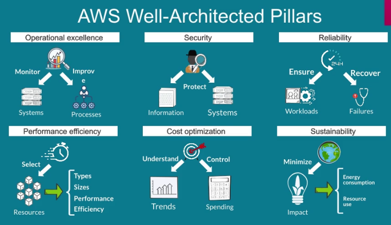

# AWS Cloud Quest: Cloud Practitioner

Basic gamified course to go through the basic AWS services, completing assignments that help apply the learnt knowledge and gaining experience by deploying solutions.

People have their own infrastructure that can be less reliable and costly. AWS provides technology so that you use their infrastructure and multiple services on demand.

## Global Infrastructure

AWS Regions -> 2+ (3) Availability Zones AZ -> 1+ (3) Data Centers DC -> Point of Presence PoP in edge locations. There's only PoPs in Mexico.

Redundancy and reliability (with load balancers for outages), Custom hardware, Security (military and secret orgs use it), Scalability (according to needs and usage). Low cost (becuase it's the biggest DC footprint).

## Amazon S3

### Theory

Amazon Simple Storage Service. Static webpages don't run scripts in the back of the server, but on the client-side. Amazon S3 provides hosting of webpages that are fully managed. You can only host static webpages in S3. Resilient because of replications across multiple AWS data centers.

Object oriented service. Each file is an object with data and metadata. Objects go on buckets and can be accessed with a simple URL. This storage is useful to host webpages and apps. The "bucket size" depends on the traffic of the bucket, which adapts continuously. Encrypted and compliant with regulations. Can enable only private access and set up multi-level accounts. AWS Parner Networks is a network of providers to help migrate.

Storage classes are defined according to access frequency and time to access. Standard is frequent access (FA) with millisecond access. Data can be automatically managed signing lifecycle policies, defined from access patterns, moving objects between storage classes until expirement and reducing costs. Objects analytics directly on AWS with SQL queries and more. Versions of objects can be enabled to be preserved and restored, saved through IDs.

Two types of access levels. Resource-based policies for buckets and objects, defining access levels for different type of users. User policies to define access to diferent resources for specific users inside a root account. Buckets are private to the user which created them by default.

### Practice

Access S3 service inside the AWS Management Console. There are multiple buckets. In the permissions settings we can edit the bucket policy. In properties we can enable static website hosting, getting a url like:

http://website-bucket-0ce6dbb0.s3-website-us-east-1.amazonaws.com

https://bucket-name.s3.Region.amazonaws.com/key
