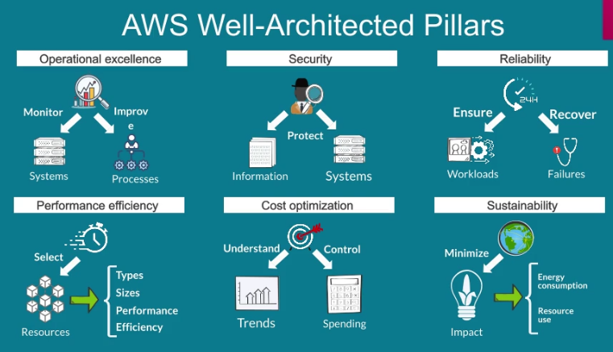

## AWS Cloud Quest: Cloud Practitioner

Basic gamified course to go through the basic AWS services, completing assignments that help apply the learnt knowledge and gaining experience by deploying solutions.

People have their own infrastructure that can be less reliable and costly. AWS provides technology so that you use their infrastructure and multiple services on demand.

## Global Infrastructure

AWS Regions -> 2+ (3) Availability Zones AZ -> 1+ (3) Data Centers DC -> Point of Presence PoP in edge locations. There's only PoPs in Mexico.

Redundancy and reliability (with load balancers for outages), Custom hardware, Security (military and secret orgs use it), Scalability (according to needs and usage). Low cost (because it's the biggest DC footprint).

## Amazon S3

### Theory

Amazon Simple Storage Service. 

Amazon S3 provides hosting of webpages that are fully managed. You can only host static webpages in S3 (that don't run server side scripts). Resilient because of replications across multiple AWS DCs.

Object oriented service. Each file is an object with data and metadata. Objects go on buckets and can be accessed with a simple URL. The "bucket size" depends on the traffic of the bucket, which adapts continuously. Encrypted and compliant with regulations. Can enable only private access and set up multi-level accounts. AWS Partner Networks is a network of providers to help migrate.

Storage classes are defined according to access frequency and time to access. Standard is frequent access (FA) with millisecond access. Glacier is unfrequent access but most resilient and reliable.

Data can be automatically managed signing lifecycle policies, defined from access patterns, moving objects between storage classes until they expire and reducing costs. Objects analytics directly on AWS with SQL queries and more. Versions of objects can be enabled to be preserved and restored, saved through IDs.

Two types of access levels. Resource-based policies for buckets and objects, defining access levels for different type of users. User policies to define access to diferent resources for specific users inside a root account. Buckets are private to the user which created them by default.

### Practice

Access S3 service inside the AWS Management Console. There are multiple buckets. In the permissions settings we can edit the bucket policy. In properties we can enable static website hosting, getting a url like:

http://website-bucket-0ce6dbb0.s3-website-us-east-1.amazonaws.com

https://`bucket-name`.s3.`Region`.amazonaws.com/key

## Amazon EC2 and EBS

### Theory

Amazon Elastic Compute Cloud, Elastic Block Storage.

Many instance types depending on CPU, Memory, GPU, Storage, and Networking. There's a general purpose one and different tailored to each property. An instance is launched from a machine image (AMI). It is the "class" of the instance, where software configurations is defined beforehand.

Persistent storage can go to an EBS. Many EBS volumes for an instance, but only one instance assigned for each EBS. Because of this "mounting", 0-9ms latency. Volume types: SSDs for high-speed, latency-sensitive small operations, best for in I/O ops/s. HDDs best for MB and GB/s on fewer txs. Backup snapshots go to S3 that are incremental (track changes and non-redundant backups). DLM (data lifecyle manager) also works for snapshots. Encrypted static and in-transit. Elastic in size (resize as app changes).

### Practice

Process to launch EC2 instance. Select: locations (repeated or single), AMI, instance type, VPCs, storage, security groups, launch. Location that we select are between AZs.

Security groups for different types of connections which expand different ports is recommended to act as a firewall for unintended access.

At initiation of the instance we can give a script for it to run after creation. Our script sets up an `index.html` file to host a web server.

http ://ec2-`10-0-0-1`.compute-1.amazonaws.com/
