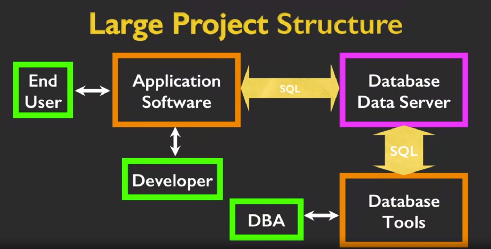
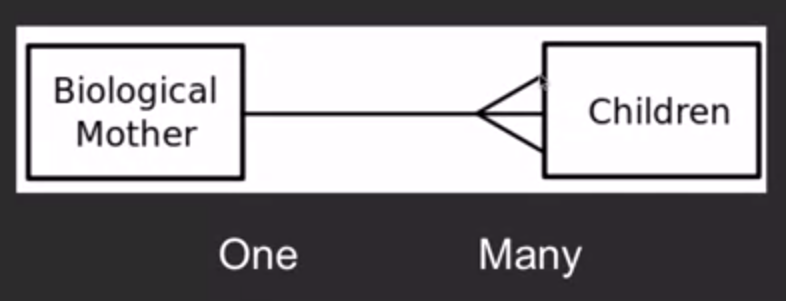
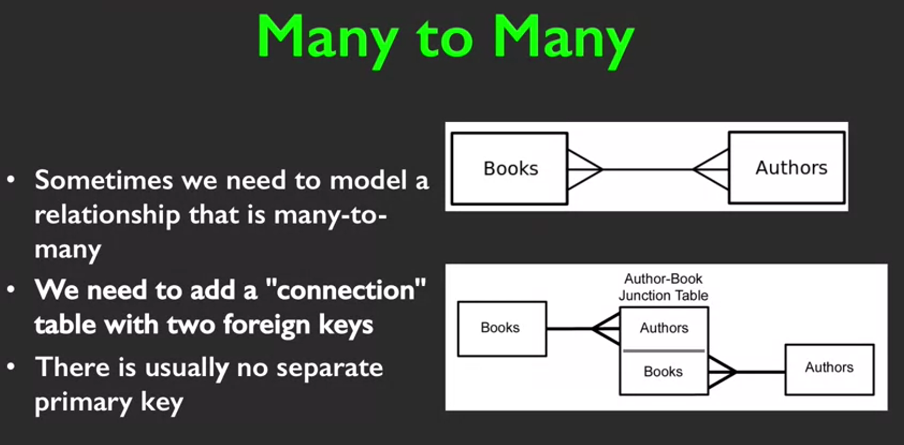

# Using Databases with Python

## OOP in Python

There are attributes and methods inside each instance of a class. Python always passes a parameter to every method call implicitly which contains a reference to the object at which the method is being called. By convention this first argument is always defined as `self`.

E.g.:

```python
# point.py
class Point:
    def __init__(self, x, y):
        print("2. Initialize the new instance of Point.")
        self.x = x
        self.y = y

    def __repr__(self) -> str:
        return f"{type(self).__name__}(x={self.x}, y={self.y})"
```

The method also takes \*args and \*\*kwargs, which allow for passing an undefined number of initialization arguments to the underlying instance.

`__repr__` is the string representation of the class.

```python
>>> from point import Point

>>> point = Point(21, 42)
1. Create a new instance of Point.
2. Initialize the new instance of Point.

>>> point
Point(x=21, y=42)
```

Object inheritance can be defined like:

```python
class RedPoint(Point):
    def show():
        print("I am red")
```

It extends the methods inside the original class to this subclass so that they can still be called.

## Relational Databases

Databases emerged when people figured out how to solve the speed at which we can access data stored randomly in a disk. Through clever relations between data one can stop looking at the data in a straightforward and linear way and instead do some skips between the data to obtain only whatever we really need. This way we do not have to scan through petabytes of data to browse the internet.

* Relation (table), tuple (row) and attribute (column)

    Structured Query Language is the connection between an application and the service offered by a database. It is like the API that can be used by programmers to communicate with this really complex set of instructions hidden inside a DB. SQL represents the service layer of a RDBMS. SQL is really simple and expressive as long as the data provided is structured. Python can be used to structure unorganized data, resulting on a powerful pair of tools.

CRUD (create, retrieve, insert, delete)

## Roles in DB development



Generally the Database Administrator will use tools to handle any kind of situation that could arise inside the DB server. On the other hand, a developer will use SQL to obtain data from the database and include it as part of the application software. These are separated roles, linked through the DB via SQL.

Both roles involve different tasks and objectives surrounding the desired data. While a developer will obtain data from the Internet or other files, clean it, and save it into the DB, a DBA will confirm the correct management of the data inside of the server. The developer will also create scripts to obtain back the data and display it through other interfaces.

## Different RDBMS

* Oracle: one of the best or the best, they bet on RDBs from the start, for enterprises. PostgreSQL is a competitor because of its rich functions.

* MySQL: bought by Oracle (MariaDB is the open-source equal alternative), great for WEB since it's fast, less features but very powerful

* SQL Server: for microsoft products, enterprise use

* SQLite: very small so it can be built in into applications

## Schema and Models

A databse model or database schema is a contract which designates the structure and format of a DB. It specifies the data types for every attribute in a relation. It can be represented with an ER (Entity Relationship) model or kind of model that can represent the relationships between multiple objects (tables).

A good way to map a system into a model is to determine the most basic entities or objects first and then keep describing its attributes and relations. Connect entities through identifiers that can be primary keys. Logical keys are used to designate a field that might be used as a key for a where clause, to make it faster.

Different organizations might have different naming conventions for objects and keys.

## Relational SQL

We can use a `JOIN` betwen tables to glue them together. Without an on clause we will get all the possible combinations between the tuples in each table. With an on clause that uses the specific identifiers found on each table we will be able to match only the desired information between tables.

We can match multiple tables in a single query like

```sql
SELECT * FROM Track JOIN Genre JOIN Album JOIN Artist ON Track.albumId = Album.albumId AND Track.genreId = Genre.genreId AND Album.artistId = Artist.artistId
```

In another way, which is actually slower, we can join through the `WHERE` clause

```sql
SELECT * FROM Track, Album, Artist, Genre WHERE Track.genreId = Genre.genreId, Track.albumId = Album.albumId, Album.artistId = Artist.artistId
```

## 1 to N Relationships



## N to N Relationships

Many to many relationships are different than one to many relationships because modeling both tables directly can be complicated (have a lot of unused data in both tables, different combinations, etc.). We can use a intermediary table between both that relates only the relevant keys in both tablesl, obtaining two 1 to N relationships.

We can consider the intermediary table as a membership or contract table between the other two tables. Each element of both tables can have more than one contract but a contract will only relate a single element with another single element.



Order by can take more than argument. The first arguments are the ones with most priority and the last ones with the least. Each argument can be set to ASC OR DESC.

## Intro to Data Mining

During a project it is common that we have multiple Python scripts that have different purposes that range in the different stages of recollecting and analyzing data from the web. This process could be described as "Personal Data Mining", since it isn't as complex to be considered data mining.

* The retrieval can be paired with as DB to account for errors, saving data states

* The raw data is then parsed or cleaned into another database

* The clean data is passed through scripts to visualize and analyze it
