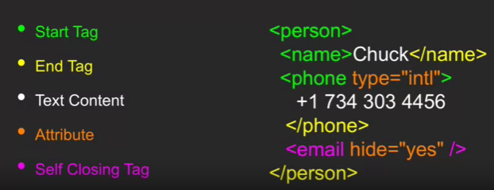
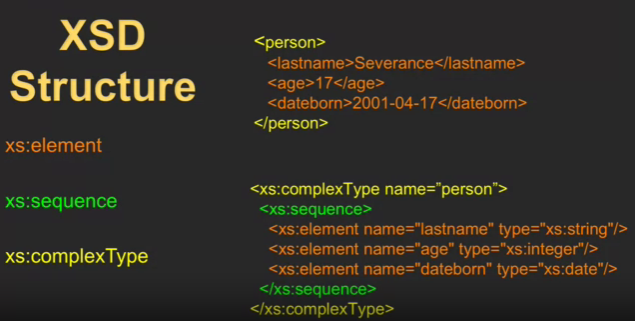

## Regular Expressions

They are formatted or "wild card" strings that can match other strings. It is like specifying certain conditions that will make a regular expression match with any other expression / string. It can be used to search through text with certain restrictions that are specified with certain characters. It is like programming with characters:


Regular expressions can be used through a library for python. By using the search method we can search through the specified string for any substring or expression specified

```python
import re

hand = open('text.txt')
for line in hand:
    line = line.rstrip()
    if re.search('From:', line):
    print(line)
```

| Method                      | Description                                 |
| --------------------------- | ------------------------------------------- |
| .search(*regex*, *source*)  | Get boolean if match found                  |
| .findall(*regex*, *source*) | Get list of all matches, if none then empty |

This would just search for `From: ` at any point in the text, but, for example, if we wanted to search it as startswith() then we can use `^From: `. A more complicated one could be `^X.*:`, which means that we are searching for any string that starts with `X`, followed by any character in any quantity but that has at some point a `:`.

By greedy it means that the result to a regular expression match will be the largest possible in characters. The `*` and `+` operators are greedy by default, but can be changed to non-greedy, which means that they will get the smallest possible match instead. Useful for these type of cases:

**Greedy**


**Non-greedy**


## Network Technology

TCPs (Transfer Control Protocols) create pipes for two different devices to communicate between each other. They use an Internet Protocol (IP) address. Generally, the app prepares data through a protocol (transport) and this reaches the internet through an ethernet link. After this, it goes through multiple pathways and eventually reaches the end device. The connection is called the socket.

Stablishing a socket with a device can be done simply with its address and a port

```python
import socket
mysocket = socket.socket(socket.AF_INET, socket.SOCK_STREAM)
mysocket.connect( ('data.pr4e.org', 80) )
```

A protocol is a set of rules for communication. HTTP (HyperText Transfer Protocol) is the most basic protocol that emerged for web interaction.

## HTTP

For example, in an HTTP connection between devices, **GET** requests are submitted from the client to the host device and this last one sends a response with the HTML document to load a webpage. This is the request-response cycle.

The format of the response includes a header (with metadata) and the content, which includes the requested document.

You can perform a get request to a server by encoding the command into bytes

```python
cmd = 'GET http://data.pr4e.org/romeo.txt HTTP/1.0\r\n\r\n'.encode()
```

The entire response might take multiple receive commands if it is too long, which is why it might be useful to use a while loop. We receive the information 512 chars at a time.

```python
while True:
    data = mysocket.recv(512)
    if (len(data) < 1):
        break
    print(data.decode())
mysocket.close()
```

The response will be in bytes and should be handled according to the data's information. Since we are returning text we just convert it back to UNICODE

200 is success, 404 is not found 

## Unicode, ASCII and characters

ASCII only considered the most basic characters in the latin alphabet in a single byte. UTF-8 is part of UNICODE and allows characters to be declared with more than 1 byte whenever there is a character specifying so. This means that all ASCII characters are in UTF-8.

In python 2 strings and bytes were the same, and unicode strings different.

In pyhton 3 bytes and strings are different, but all strings are unicode.

`str.encode()` turns the string into bytes and `str.decode()` turns it back to UTF-8

## Easier sockets

Connection with a server and requesting of a document that is saved as a file handle and manipulated as if it were a file.

```python
import urllib.request, urllib.parse, urllib.error
fhand = urllib.request.urlopen('http://data.pr4e.org/romeo.txt')
for line in fhand:
    print(line.decode().strip())
```

## Web Scraping and Parsing

To create a script that pretends to be a browser and retrieves data from web pages and specific information. Also called spidering. Could be illegal depending on what you are trying to retrieve because of copyright or terms and conditions of websites.

Parsing is to obtain the individual sets of information wanted from a structured syntax. HTML forgives some syntax errors, which is why it is hard to parse HTML structured information correctly as, for example, some regex could be positive for some pages but not for others, or it could contain more elements not considered on others, etc. 

[Beautiful Soup: We called him Tortoise because he taught us.](https://www.crummy.com/software/BeautifulSoup/)

[Beautiful Soup Documentation](https://www.crummy.com/software/BeautifulSoup/bs4/doc/)

Beautiful Soup is a library that can parse an HTML document into an object with attributes that lead to more specific information about the webpage, for example:

```python
soup.title
# <title>The Dormouse's story</title>

soup.title.name
# u'title'

soup.title.string
# u'The Dormouse's story'

soup.title.parent.name
# u'head'

soup.p
# <p class="title"><b>The Dormouse's story</b></p>

soup.p['class']
# u'title'

soup.a
# <a class="sister" href="http://example.com/elsie" id="link1">Elsie</a>

soup.find_all('a')
# [<a class="sister" href="http://example.com/elsie" id="link1">Elsie</a>,
#  <a class="sister" href="http://example.com/lacie" id="link2">Lacie</a>,
#  <a class="sister" href="http://example.com/tillie" id="link3">Tillie</a>]

soup.find(id="link3")
# <a class="sister" href="http://example.com/tillie" id="link3">Tillie</a>
```

To use it you have to select a parser.

* lxml: very fast and lenient, external library

* default html python parser: fast and lenient, already included

```python
from bs4 import BeautifulSoup
html_doc = "<html>a web page</html>"

soup = BeautifulSoup(html_doc, 'html.parser')
```

After getting the `BeautifulSoup` object one can get multiple attributes of the parsed document, like performing `soup('a')`, which returns a list of all the anchor tags that were found as `Tag` objects. Inside of these objects you can obtain multiple attributes and methods such as `tag.string`, to obtain the contents of the a tag, or `tag['href']`, to obtain the `'href'` attribute of the tag, etc.

## Formatting Data

The Wire Protocol refers to the way in which data leaves a system to enter another, maintaining what is called a *wire*, an agreed on format. It is a protocol agreed on by both systems for the communication of information. The sender serializes the data into the wire, and the receiver de-serializes it to retrieve it. This is important to truly develop data-oriented systems, instead of language-oriented ones. A client using Python can communicate with another using Java

Two serialization formats are XML and JSON. 

### XML and XML Schema

In the eXtensible Markup Language (XML) there are start tags and end tags to represent a node or element. The name represents what it is. Complex elements are the ones that can have nested elements, and simple elements are the ones that can't. Indenting doesn't matter, similar to HTML. Comes from SGML (Standard Generalized Markup Language), as a simplified version.



It could be said that a tag represents an object of something. For example, an object `instructions` could contain nested `steps` objects for a recipe. 

When viewing XML as a tree we can represent each tag as a node, and every nested tag as a child. Also, any text node (content of a tag) and attribute node (attribute of a tag) is also a children of the tag that contains it. To traverse through the elements, paths can be created, like, for example, `/person/phone`.

An XML Schema document is an XML document that is designed to restrict and define the multiple possible elements, and more, that could be created in the process of communicating through XML serialization. Like a contract to what is acceptable. Verification that the data is in the correct format.

An XML validator takes in an XML Schema and an XML serialization to confirm that the data is correctly formatted.

There are multiple XML Schema "languages" that are already defined by organizations or institutions. One of the most recognized and used one is XSD, by the World Wide Web Consortium (W3C).



A schema can also define constraints for certain elements, allowing precise exchanging of data in a structured format. These are declared with already defined attributes by XSD that are applied to the element, such as `minOccurs` and `maxOccurs`. There are also other specific XSD elements to creaate restrictions (like `xs:restriction` and to achieve other semantic value. The `type` attribute is used to define the data type of the content of the element.

* date format: YYYY-MM-DD

* dateTime format: YYYY-MM-DDTHH:MM:SSZ, where T is just a delimiter and Z is the time zone to be used. 

[A more complex schema to practice](https://www.w3schools.com/xml/schema_example.asp)

`xml.etree.ElementTree` to parse XML, [documentation](https://docs.python.org/3/library/xml.etree.elementtree.html)

### JSON

Vary native from JavaScript. Very similar to Python in the list and dictionary syntax. "Discovered" because the creator realized it could be used as a data interchange format from its normal use in JavaScript. JSON was created to be an easy to use format specifically designed for programming languages and AJAX, contrary to XML.

JSON will never change just like the alphabet never changes. We might find ways to create words and sentences on top of the alphabet as we find ways to build applications on top of JSON. Once JSON is obsolete, something else will take over, but anything still built over JSON will keep working.

### APIs

APIs are born from a service-oriented-approach where you can offer a service to a client that you yourself aren't really the creator or responsible of. Through APIs you can connect different isolated systems into one to obtain different functionalities from each of them.

[Service layer and service-oriented-systems](https://d3c33hcgiwev3.cloudfront.net/XQHLlV9MEeWHrhLGHHq1Gw.processed/full/540p/index.webm?Expires=1703548800&Signature=IOmdTgNDbpY-V8esDwdj8CrEpoWnY-d4bIF-K~1jLoT6BtR6d1B4rmgEurqTm9FpgENZF6mnjp8oiUrvh1xQjUVXUKeCIj1yobn1NoPr7QADyQiVjHFdL2IgAv-4l9wcmvEIcnvI7JFBjXcgWKOYLDE8KEsoqaC0GU8KV3hJQ18_&Key-Pair-Id=APKAJLTNE6QMUY6HBC5A)

APIs represent a service layer that allow a system to use another system's functionalities, data, and more, based on a common format in which all systems can communicate after passing the local information through a service layer.

APIs usually have documentation so that any external system can derive the functionalities to obtain and how to read the data that was passed through the service layer.

Some APIs require personal authentication to keep track of individual users. This auth is done through matching tokens and keys provided during the request. Also, some APIs limit your usage of their methods and data, as they require more computation behind to be able to return the data that you need. This is why there are usually limitations on the amount of API calls that one can do for free, before breaching a range where a company starts monetizing their services. 
