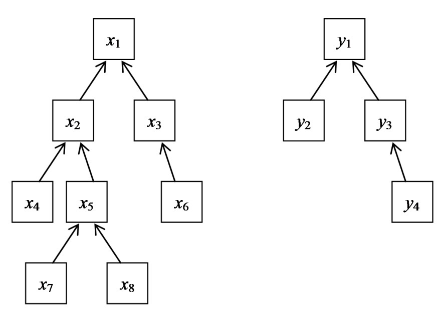
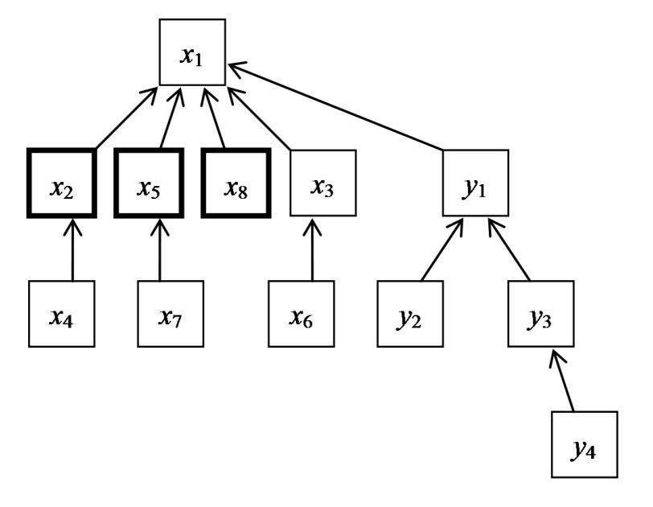

Some topics to refresh and practice more often:

- deque in Python
- iterative traversal with BFS

## Line Sweep / Diff Array

Whenever we are working with intervals, instead of saving an operation for each element within each interval ( $O(km)$ ), we can instead save **event points** into a **`diff` array** in order to apply changes in a given order (from left to right) as we **sweep** through this `diff` array.

The way in which an interval is represented in a `diff` array is simple to understand with the right intuition:

- A certain operation needs to be applied with elements inside of the interval, say a simple $+1$.
- To mark the start of the operation, we register the operation starting at a given index `i`.
- The mark above will mean that all elements starting at `start_idx` until the end of the `diff` array ($\rightarrow$ `n`), will apply said operation
- We know that the operation shouldn't be applied no longer than just the end of the interval. To achieve this we do the following:
- We mark an exactly opposite operation, $-1$, starting just after the interval ends, so, at `end_idx + 1`.
- This will counter the original operation for every element after `end_idx` until the end of `diff`.

The following code exemplifies line sweep with a simple example:

```py
original = [0, 0, 0, 0, 0]
n = len(original)

# Start, end, operation
operations = [(0, 3, +10), (1, 4, -5), (2, 4, -10)]

diff = [0] * (n + 1) # n + 1 for left over counter operations at the end
for start, end, op in operations:
    # Save operation onwards
    diff[start] += op
    # Apply counter-operation onwards
    diff[end+1] -= op

# Sweep through diff array
# Accumulating operations in the way
sweep = 0
for i in range(n):
    sweep += diff[i]
    # Apply and accumulate (sweep) operations 
    original[i] += sweep

print(original)
# [10, 5, -5, -5, -15]
```

## Prefix Sum

It's a basic technique that ressembles DP in some ways, since it breaks down a problem in subproblems that are overlapping and that are built up incrementally. By keeping an array with the result of the calculations for indices `i` and lower (the "sum" for our prefix) we can build the solution for the following index `i+1` by using the latest calculated prefix sum.

It's helpful for cumulative calculations that involve ranges or attributes specific to an element's location (index).

Because of how it works, a prefix sum is like the "sweep" explained above.

## Bitwise operations

These are operations that work directly over the binary representation of integers. We take as input the two integers we'll be applying the operation over, and get as output another int.

They are called "bitwise" precisely because we apply the operation over THE BITS of the integers, not over the integers themselves. So, we take each of the bits of each number (by position) and compare them between each other so as to apply the operation.

For example:

```python
# Bitwise AND
5 & 3 # 0101 & 0011 -> 0001 -> int 1

# Bitwise OR
5 | 3 # 0101 | 0011 -> 0111 -> int 7

# Bitwise XOR
5 ^ 3 # 0101 ^ 0011 -> 0110 -> int 6

# Bitwise NOT
~5    # ~0101       -> 1010 -> int 10
```

Apart from these basic boolean operations over bits, we can also manipulate them in another very interesting way.

We perform Bit Shifting to shift ALL THE BITS of an int to the right or left.

The shift does NOT cycle the bits, but the state of the bit we add or remove can change. Specifically, the behavior for shifts will is:

- For shifts to the left, be the number either positive or negative, we add 0s at the rightmost position.
- For shifts to the right things change a bit. For positive numbers we add 0s at the leftmost position. 
- For negative numbers, which are represented in two's complement, we add 1s at the leftmost position in order to preserve the negative value. This because a complement means that bits are inverted "infinitely", so all 0s to the left of positive numbers would acount for 1s.

Remember, to convert a number to and from two's complement we:

- Invert the bits
- Add one

The operator shifts an integer (the one to its left), by X bits (the int to its right).

```python
# Left shift of positive
5 << 1 # 0101 -> 1010 -> int 10

# Left shift of negative
-5 << 1 # 1011 -> 0110 -> int -10

# Right shift of positive
5 >> 1 # 0101 -> 0010 -> int 2

# Right shift of negative
-5 >> 1 # 1011 -> 1101 -> int -3
```

Basic way of efficiently "iterating" over bits using bitwise operations.

Careful: This method "destroys" the number (by shifting bits to "read" them)

```python
# For positive numbers
# Alters the original number
num = 5
temp = num
while num > 0
    print(num & 1) # "Extract" least significant bit
    num = num >> 1 # "Move" to next bit

# For negative numbers (since 1s to the left in a complement are "infinite")
# Doesn't alter the original number
n = -5
num_bits = 8  # Limit to 8 bits
for i in range(num_bits):
    print((n >> i) & 1)
```

A clever way to flip the bit at the ith position:

```python
n = n ^ (1 << i)
# 5 ^ (1 << 2) -> 0101 ^ 0100 -> 0001 -> int 1
```

## XOR operator

One of the most commonly used for leetcode problems because of its interesting properties that make very complex problems reduce to simple abstractions.

The best way to see the operator is as a "bit flip", which can be seen in the operator's truth table:

| $A$ | $B$ | $A \oplus B$ |
|:-:|:-:|:-------:|
| 0 | 0 |    0    |
| 0 | 1 |    1    |
| 1 | 0 |    1    |
| 1 | 1 |    0    |

Viewing the operation as nothing but a "toggle", we can easily identify the following properties:

- Commutative: $a \oplus b = b \oplus a$
- Associative: $a \oplus (b \oplus c) = (a \oplus b) \oplus c$
- Identity: $a \oplus 0 = a$ (doesn't change)
- Self-inverse: $a \oplus a = 0$ (always is 0)

Taking these properties we can create interesting phenomenon to simplify complex calculations:

- Cancellation: When a same element is XORed with itself an even number of times, it cancels to just $0$. Similarly, the element XORed with itself an odd number of times will just leave the original element.

## Reverse Mapping

This technique is useful when we are working with two different spaces. Specially when our task is to determine connections, match elements or verify a "mapping" between both spaces (a condition that rules the transformation of elements between spaces, like a function or relationship).

The easiest way to work with mappings is through hashmaps, in order to match the "output" of one space into the other's "input".

Also, with these type of problems it might be helpful solve the problem in the reverse order of which it is described. For example, if we were asked to iterate forward through `arr`, of size $m\cdot n$, until filling an $m\cdot n$ matrix `mat` based on some criteria, we could use the criteria to iterate `mat` instead until getting an answer from `arr`.

## Disjoin-Sets and Union-Find

A **disjoin-set data structure** keeps track of $n$ elements along one or more pairwise disjoint sets (non-overlapping) $S=\{S_1, S_2,\ldots,S_r\}$. Each $S_i$ should have at least one element, and have an arbitrary element chosen as its representative, denoted as $rep[S_i]$.

> An example for a set's representative is the root of a group of nodes in a directed graph.

Keeping elements in such sets or groups allow us to perform a very powerful algorithm called **union-find**. The algorithm has three primary operations:

- `Make(x)`: Create a new set with one element
- `Find(x)`: Determine the subset where an element is contained
- `Union(x, y)`: Union of $S_x$ and $S_y$ only if both elements $x$ and $y$ are in fact in distinct sets, such that $S_x \neq S_y$.

The most common representation for this data structure is a tree:



Each element $x_i$ or $y_i$ started off as `Make(x)` with representative as themselves.

The representative for each of these sets was changed through `Union()` operations. So, we changed the "root" of each $x_i$ and $y_i$ element to eventually become $x_1$ and $y_1$ respectively.

### 1st Improvement: Union By Size

If the `Union()` concatenated each element from $S_y$ into $S_x$, so, the second set to the first, our worse case scenario would be $\text{Union}(i, i+1)$ for $i = n-2,n-3,\ldots,0$. In such scenario we would have a time complexity of $O(n^2)$

Instead, we can try to concatenate the smallest set into the largest. If we always concatenated this way across all `Union()` operations until achieving one unique set, we would join exactly $n-1$ times. So, $O(n)$

To do this we would maintain a `height` array with the size of each of our disjoint sets. When doing `Union()`, we choose the set with the lowest height and update its root's representative to the largest set's root.

### 2nd Improvement: Path Compression

Then, as `Find(x)` operations are performed, we seek up the set's representative with a time complexity of $O(\text{lg}\ n)$, going up the tree until the root.

Now, if after finding the root for $x_i$ we updated our current representative to the root x_1$, the next `Find(x)` operation would be $O(1)$ since we are already there.

Finally we would have something like:



And this tree would continue compressing with the more `Find()` operations we perform.

```python
# 1-indexed disjoint set
class DisjointSet:
    def __init__(self, n):
        self.n = n+1
        self.repr = list(range(self.n))
        self.height = [0] * self.n

    def find(self, x):
        if self.repr[x] != x:
            self.repr[x] = self.find(self.repr[x])
        return self.repr[x]

    def union(self, x, y):
        rootX = self.find(x)
        rootY = self.find(y)

        if rootX != rootY:
            if self.height[rootX] > self.height[rootY]:
                self.repr[rootY] = rootX
            elif self.height[rootX] < self.height[rootY]:
                self.repr[rootX] = rootY
            else:
                self.repr[rootY] = rootX
                self.height[rootX] += 1

# Example usage:
ds = DisjointSet(5)

ds.union(0, 1)
ds.union(1, 2)
ds.union(3, 4)

print(ds.find(0))  # Should output root of set containing 0, which is 0
print(ds.find(2))  # Should output root of set containing 2, which is 0
print(ds.find(3))  # Should output root of set containing 3, which is 3
print(ds.find(4))  # Should output root of set containing 4, which is 3
```

> Check out Leetcode [684. Redundant Connection](https://leetcode.com/problems/redundant-connection/description/)

## LRU Cache and OrderedDict

An **LRU Cache** stands for Least Recently Used Cache. It's works with a given `capacity`, defined when instantiated, so that it will store up to a certain number of elements. It's most interesting functionality, and the one that gives it its name, is that it will keep an "order" or some type of "timestamp" of when an element was last used. This way, we could say that:

- Any operation over a certain key of the cache, (be it `put(key, val)` or `get(key)`), will make the given key the **most recently used** element (i.e.: freshest element).
- On the contrary, as we run operations over other keys, we'll have a ***least recently used** element (i.e.: oldest element to have been used).

Keeping this order is vital, because our cache has a limited `capacity`.:

- If we want to insert a new (key, val) pair to a **FULL** LRU Cache, we will remove the **least recently used** to make space for our **most recently used**, and new, element.
- The above process is called `eviction`.

What data structure could help with this? Yes, an **ordered dict**.

An **ordered dict** data structure keeps elements in a hashmap with a given order. The powerful thing about this dictionary is its use of a **doubly linked list** beneath it to keep the order in which each element has been used. This way, we can keep O(1) insertion, deletion, and look-up times, thus being very very efficient.

As a refresher:
 
- A `DLL` data structure contains nothing but a `head` and `tail` properties. Both of these are Doubly Linked List `Node` objects.
- Each `Node` object contains as properties: `val`, `prev`, and `next`, where `prev` and `next` contain references to other `Node` objects.
- So, an empty Doubly Linked List will just contain a `head` and `tail` pointing to each other.
- But a filled DLL will have references to nodes between `head` until getting to `tail`.

The best way to have O(1) look-up times for any LinkedList is through the use of a hashmap `nodes`. Specifically, using `key` : `Node(val)` pairs.

Now that we've reviewed the workings of a Linked List, how will it help us?

The most important method our `OrderedDict` will make use of in our DLL is `move_to_end(key)`. Through the use of the `nodes` hashmap to look-up the `key`, this method works in O(1) time. It just shifts a node's position to the last position (tail). A basic implementation looks like:

```python
def move_to_end(key):
    node = nodes[key]
    # If already tail, do nothing
    if nodes[key] == self.tail.prev:
        return
    # Connect prev and next of node
    node.prev.next, node.next.prev = node.next, node.prev
    # Connect node to tail and its previous
    node.next, node.prev = self.tail, self.tail.prev
    # Connect previous tail to node
    self.tail.prev.next, self.tail.prev = node, node
```

Python's built-in `OrderedDict` already contains the method `move_to_end(key, last=True)`.

- Move the key to the left end (first element, with `last=False`) or...
- Move the key to the right end (last element, with `last=True`)

So, the final implementation of an `LRUCache` class using `OrderedDict` looks like:

```python

from collections import OrderedDict

class LRUCache:
    def __init__(self, capacity):
        self.capacity = capacity
        self.d = OrderedDict()
    
    def get(self, key):
        if key not in self.d:
            return -1
        else:
            self.d.move_to_end(key, last=True)
            return self.d[key]

    def put(self, key, value):
        if key in self.d:
            self.d[key] = value
            self.d.move_to_end(key, last=True)
        else:
            if len(self.d) >= self.capacity:
                self.d.popitem(last=False)
            self.d[key] = value
```

> Check out Leetcode [146. LRU Cache](https://leetcode.com/problems/lru-cache/description/)
