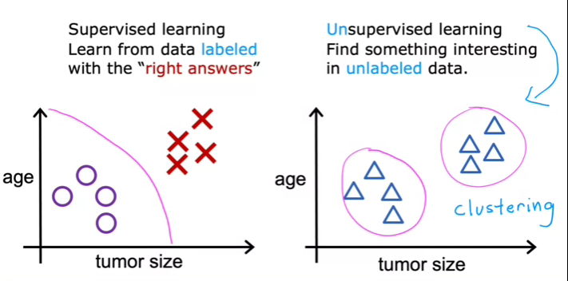

# Supervised Machine Learning Regression and Classification

## Intro to ML

Machine Learning is found in many common applications to recognize different patterns in a certain group of data. This way we can classify data into different groups depending on certain characteristics detected by algorithms.

Multiple problems can be solved by letting the machine learn by itself, since it would a notoriously difficult task to program some complex algorithms for self-driving cars, computer vision, etc.

ML is in itself a subbranch of AI. The road to an Artificial General Intelligence is being paved through AI research and new technologies. An AGI would be a capable intelligent being just as a human is.

### What is Machine Learning?

The more data is fed into a machine there more it can learn about a problem and the closer it can get to mastering a solution.

- Supervised learning: Used the most and with the most advances

- Unsupervised learning

### Intro to Supervised Learning

This type of learning is used when you know exactly what you want to give to the machine $x$ and what you want to get from it $y$. You give the machine examples of input, output pairs. By going through multiple examples the machine learns to predict the $y$ output from a given $x$ inputs.

A **regression** attempts to predict a number from infinitely many possible outputs. For example a linear regression, which fits the prediction between $x$ and $y$ values with a linear relationship. Another is a logarithmic type, which fits the data with a logarithmic function.

The regression is visualized as the line of a function $f(x)$ in a scatter plot of $x$ vs $y$.

A **classification** attempts to predict a category between a small amount of possible groups. It classifies the given input. There can be two main groups each with categories, or many groups, etc., as well as more than one input.

The classification limit can be visualized as the boundary line between both output categories, either 2D, line, for 1 input or 3D, surface, for 2 inputs.

Main difference is the number of possible outputs between both algorithms.

### Intro to Unsupervised Learning

This type of learning is used when we do not know the exact labels we want from the algorithm, but instead we want to obtain hidden patterns in the data. These hidden patterns can emerge by **clustering**.

This type of algorithms tries to find structure in a dataset by grouping or segmenting together similar values and thus obtaining different categories based on hidden patterns (hidden because we do not know the $y$ output label desired)

Another type of learning is **anomaly detection**, used to detect unusual events in a certain dataset. By detecting these scattered inputs we can, for example, detect fraud in financial systems.

**Dimensionality reduction** reduces the size of data.

Difference:



Jupyter Notebooks are the exact same tools that many large companies are using to create ML environments. In these one can describe markdown and code cells united into one document. The code cells can be run in any order desired and belong to the same environment (meaning the result of a code block can be reflected in another).

## Regression

#### Simple Linear

It is the most common regression model. It uses a training set, which is the data used to train the model. This data can be represented as two columns with inputs / features and outputs / targets.

Notation:

- $x$: Feature variable, $y$: Target variable

- $m$: Number of training examples (rows)

- $(x^i,y^i)$: ith training example (ith row)

- $w$, $b$: parameters / coefficients adjusted during the training to improve the model. weights and bias

The algorithm will produce a linear function that takes $x$ and produces an estimate to $y$, which is going to be called $\hat{y}$.

$$
\begin{align}
\hat{y}=f_{w,b}(x)=wx+b
\end{align}
$$

> For fixed $w$ and $b$, function of $x$

Through machine learning what we are going to predict are the specific parameters needed for our linear function so that every $y^i$ value is close to every $\hat{y}^i$.

Matplotlib is used to plot data and numpy is used to do scientific calculations

Create two one-dimensional Numpy arrays which are faster and smaller than a Python list. Inside we put all of the training examples, in one array the $x$ values and in the other the $y$ values. We can obtain their size to obtain $m$.

With pyplot from matplotlib we can plot both arrays.

#### Cost / Loss function

To evaluate how close an estimation is to the actual target we obtain the error by obtaining the difference between both values. Through the summation of all the errors we get the total error or cost of the estimations against the targets.

By convention, for a squared cost function, we:

- Divide the cost by $2m$ so the summation doesn't explode with large trainings sets.

- Obtain the squared error since it gives better results for regression models

$$
\begin{align}
J(w,b)=\frac{1}{2m}\sum_{i=1}^m(\hat{y}^{(i)}-y^{(i)})^2
\end{align}
$$

When $f(x)$ fits perfectly each target, then $J(w,b)=0$

$J(w,b)$ is how the cost changes with the slope and intercept, so, 3 variables, represented as either a 3D surface or as a contour plot, which is like a topographic map.

The 3D surface will ressemble a bowl. This surface doesn't because of the specific relationship between the features and its targets, but in the end there will always be a minimum point for the surface. It can be visualized in a 2D space:

The point at which the cost is the least will be the global minimum of the function, and also our desired combination of parameters.


To perform the calculations required to obtain the linear regression function we can use numpy arrays and methods. Also unpacking of an iterable object via `foo(*list)`.

To plot an interactive space into a Jupyter Notebook we can use the `ipywidgets` library. Using pyplot from matplot lib we can specify multiple properties of a graph, like:

1. `.subplots(nrows, ncols)`: Creates a figure and a set of subplots.
2. `.plot(x, y)`: Plots `y` versus `x`.
3. `.scatter(x, y)`: Creates a scatter plot of `y` versus `x`.
4. `.hlines(y, xmin, xmax)`: Draws horizontal lines at specified y-values.
5. `.vlines(x, ymin, ymax)`: Draws vertical lines at specified x-values.
6. `.set_title(title)`: Sets the title of the subplot.
7. `.set_ylabel(ylabel)`: Sets the label of the y-axis.
8. `.set_xlabel(xlabel)`: Sets the label of the x-axis.
9. `.legend(loc)`: Adds a legend to the subplot.
10. `.show()`: Displays the figure and its subplots.

#### Gradient Descent

So, how do we minimize a function like the cost function $J$?

Find the steepest point around a relative location forever until we reach a local minima of the function where we can't longer descend. The starting point will be certain values $b$ and $w$. By convention we start the gradient descend at $(0,0)$.  Different starting points can lead to different ending values when there is more than one local minima.

$$
\begin{align}
w=w-\alpha\frac{d}{dw}J(w,b)
\end{align}
$$

$$
\begin{align}
b=b-\alpha\frac{d}{db}J(w,b)
\end{align}
$$

- $\alpha$ is the magnitude of the step or learning rate
  
  - If it small, the process will be slower but more precise
  
  - If it is big, we might overshoot the minimum and never reach it.

- The derivative is the direction to which we "go down the hill".
  
  - If the rate of change is positive, decrease $w$, else, increase it.
  
  - The term is negative because negative slopes update the variable forward and positive slopes update it backwards, towards a minimum. If it were the opposite, we would be shooting to a maximum.

Both equations must be simultaneously updated. We repeat the update until both values converge (where the derivative is really really small that the term is cancelled and we end up with $w=w$ and $b=b$  ).

Considering:

$$
\begin{align}
\frac{\partial J(w,b)}{\partial w}  &= \frac{1}{m} \sum\limits_{i = 0}^{m-1} (f_{w,b}(x^{(i)}) - y^{(i)})x^{(i)}
\end{align}
$$

$$
\begin{align}
  \frac{\partial J(w,b)}{\partial b}  &= \frac{1}{m} \sum\limits_{i = 0}^{m-1} (f_{w,b}(x^{(i)}) - y^{(i)})
\end{align}
$$

the final big equations extending $\frac{d}{dw}J(w,b)$, look like:

$$
\begin{align}
w^{(j+1)}=w^{(j)}-\alpha\frac{1}{m} \sum\limits_{i = 0}^{m-1} (f_{w,b}(x^{(i)}) - y^{(i)})x^{(i)}
\end{align}
$$

$$
\begin{align}
b^{(j+1)}=b^{(j)}-\alpha\frac{1}{m} \sum\limits_{i = 0}^{m-1} (f_{w,b}(x^{(i)}) - y^{(i)})
\end{align}
$$

Because this is batch gradient descent (always taking into account all the training set for $f(w,b)$), to compute it we have to use two main loops:

- $i$: To compute the summatory of all the costs and thus get the total cost for the specific $(w,b)$ pair, and then compute its corresponding derivative.

- $j$: To compute each gradient until we end the gradient descent

First loop is a function on its own,

`compute_gradient(x,y,w,b) -> (dJ_dw, dJ_db)`,

to calculate the partial derivative (or gradient) which includes the cost summatory, and the second,

`gradient_descent(x,y,w_in,b_in,alpha,*helper_functions) -> (fin_w,fin_b)`, 

is another that will call the first to add the step as many times as needed to get to the minima.

The last function can be stopped with a convergence threshold value `epsilon` (when $w$ and $b$ are unchanged when the gradient becomes really small because we are really close to the minima) or with a set `num_iters`. We combine both to instead define a `max_iters` value when the defined threshold can't be met.

With a squared cost function, as we come closer to the minima the gradient becomes smaller, and thus we start taking smaller steps to the end. This is because in a cuadratic function we go from steep rates of change to flat ones as we approach a derivative with value 0.

### Multiple Linear

When we want to train a regression model with multiple features we denote multiple $x$ features $(x_1,x_2,\dots,x_n)$ inside each training example $(x^{(1)},x^{(2)},\dots,x^{(m)})$. Each training example, is a list or vector of features. A regression model with $n$ features will have a vector of $n$ weights:

$$
f_{w,b}(x)=w_1x_1+w_2x_2+\ldots+w_nx_n+b=\vec{w}\cdot\vec{x}+b\\

\vec{w}=[w_1,w_2,\ldots,w_n]\\

\vec{b}=[b_1,b_2,\ldots,b_n]
$$

Implementing $f_{w,b}(x)$ with vectorization makes the computation faster and the code smaller. For example:

```python
x = np.array([10, 20, 30])
w = np.array([-5.2, 1.2, 3.2])
b = 4
f = np.dot(w,x) + b
```

Adding more features to the cost and gradient descent functions is easy. It is like if we had more individual functions of $w$ and $x^{(i)}$ but for each weight, so $w_j$ and $x_j^{(i)}$.

An alternative is the normal equation, only used in linear regression. It is a bad equation for a large amount of features (>10k) but can solve for $w$ and $b$ without iterations (parallel). May be used in the background of some ML libraries.

Introduction to numpy vectors and matrices and their operations:

```python
# General operations:
np.sum(a)
np.mean(a)
-a # [-a[0], ..., -a[n-1]]
a + b # [a[0]+b[0], ..., a[n-1]+b[n-1]]
a * 5 # [a[0]*5, ..., a[n-1]*5], Broadcast

# Vector (x) Operations:
np.zeros(m)
np.arange(m) # Fills vector of size m with the sequence
np.random.rand(m)
np.array([1,...,10])
a[-1]
a[2:9:2]
np.dot(a,b) # a[0]*b[0] + ... + a[n-1]*b[n-1]
7.shape # ()
[1,2,5].shape # (3,)

# Matrix (X) Operations:
np.zeros(m,n)
np.arange(m).reshape(-1,n) # Create a new n based on m (m/n has to be exact)
np.random.rand(m,n)
np.array([[],...,[]])
a[-1, 2]
a[0:2, 2:9:2]
a[1,:] == a[1]
a.reshape(-1,2) # -1 determines m given previous size and n value
[[1],[2],[3]].shape # (3,1)
```

Additionally, an integer can be changed into a floating point number like $4\rightarrow 4.$

When we calculate the gradient $\frac{dJ(\vec{w}b)}{dw_j}$ we save it in the gradient vector $\vec{dw}[j]$, which saves each gradient of each feature. So, each training example $i$ from the training set of $m$ examples is iterated, inside which each feature $j$ is iterated from the $n$ features.

As expected, we leverage the training examples' loop to keep constructing the $\frac{dJ(\vec{w,b})}{db}$ just as we used it in the simple regression. Important to remember that the purpose of this high level loop is to construct $f_{w_i,b}(x_i)$, which uses all features $j$ of a certain training example $i$, which means it uses the vector $X[i,:]$ a total $j$ times through dot product.

#### Optimizing Gradient Descent

When a model is trained it is likely that:

- Features that can range a lot and are big will have smaller weights (to reduce the impact of big changes).

- Features that range very little and are small will have bigger weights (to give more impact for small changes).

To optimize gradient descent we can do feature scaling in order to rescale the training data so that the ranges of every feature are similar. When the features' ranges are similar so are (usually) the weights' ranges, and thus the time to search for each correct weight will be similar between both features.

For example, performing gradient descent towards $w_1=50,w_2=0.1$ can take more time because we take more unnecessary jumps in one variable while waiting for the other to arrive to the minimum point. Scaling features so that we go towards similar weights, like $w_1=0.45, w_2=0.75$ will make gradient descent faster.


Some types of scaling are:

- Simple scaling from max: 

$$
x_j^{(i)}=\frac{x_j^{(i)}}{\text{max}(x_j)}\quad \text{with range}\quad [\ldots,1]
$$

- Mean normalization:

$$
x_j^{(i)}=\frac{x_j^{(i)}-\mu_j}{\text{max}(x_j)-\text{min}(x_j)}\quad \text{with range}\quad [-1, 1]
$$

- Standardization (Z-Score Normalization): Reduces impact of outliers

$$
x_j^{(i)} = \frac{x_j^{(i)}-\mu_j}{\sigma_j} 
$$

We can graph the cost across multiple iteration frames to confirm that the gradient descent is going as planned. The cost should never increase while the algorithm is running. When the cost stabilizes and stops decreasing we say it has met a convergence point.

We adjust the learning rate so that the cost never increases through operations, as that would mean we are overshooting the minimum.

`np.ptp(array, axis)` returns the difference between its max and min values, obtaining range for the data. Useful to compare ranges of features before and after normalization (scaling).

With multiple features since we can't plot the results against all of our features (high dimensional spaces), we can plot charts for each feature comparing the estimated and target prices separately. Note that both $y$ and $\hat{y}$ rely on all features and this is just a visual way to show how they change with respect to an $x_j$ feature.


### Polynomial

`np.c_(array1, array2, ..., arrayN)` concatenates multiple arrays long their second axis. This means $[1,2,3]$ and $[-1,-2.-3]$ is concatenated like $[[1,-1],[2,-2],[3,-3]]$.

We can create more or different features by performing operations on the original ones. With the new features we can compute other types of feature-estimation correlations and observe different impacts on the final model that can make it more or less accurate (increase or decrease the cost). By doing this, we can determine new features that better model our target values.

One of the ways to engineer a feature is to raise them to another power. By doing so, we change from fitting a line into fitting curves for our regression model. We can see this "modification" to a feature $x_j$ as an additional setting, similar to $w_j$, which affects the final model and can shape it closer to real values.

A weight will be higher for a feature that has a great correlation with the target value and lower for features that can be dismissed. Considering this, by performing gradient descent over multiple engineered features of a single original feature varying in degree, we can tell which degree has the most impact by its resulting weight, and thus which order has the best correlation and that we should be using. For example:

$$
y=1\cdot x_0^2+0.049\\

w=[1]
$$


The weight value $1$ means it is a perfect correlation.

Scaling the features and increasing the order of the polynomial we get:

$$
y=.0000527x+113x^2+.0000843x^3+123.5\\

w=[5.27 \times 10^{-5}, 1.13 \times 10^{2}, 8.43 \times 10^{-5}]
$$


The gigantic weight value for the second term compared to the minuscule weight of the others tell us that only the term of degree $2$ is important.


Above, it is clear that the $x^2$ feature mapped against the target value $y$ is linear. Linear regression can then easily generate a model using that feature. Therefore, it's accurate to say that polynomial regression is essentially a specialized type of linear regression where you've "pre-processed" the features to represent non-linear relationships between the feature and the target.

## Classification

Predict a category or class instead of an infinite number of estimations through logistic regression. In binary classification we only have two possible answers, $1$ or $0$, or the positive and negative classes. Using linear regression to obtain a decision boundary is incorrect as outliers can heavily impact it and can cause misclassification.

For example, a function $f_{w,b}(x)$ that classifies $<0.5$ values into $\text{A}$ and $>=0.5$ values to $B$ instead. Linear regression is not optimal because we don't care by how much a value should belong to one class, but just the fact that it does. That's why outliers and more normal values should be treated equally only taking into account their relative location to the classification boundary.

Used for fraud detection, detect spam emails, etc.

### Simple, Multiple, Polynomial

A sigmoid function is used to calculate the "probability" that the class $y$ is $1$ depending on $x$ with parameters $\vec{w}$ and $b$.

$$
\begin{align}
P(y=1|x;\vec{w},b)
\end{align}
$$

The general form of a logistic regression function is:

$$
\begin{align}
f_{\vec{w},b}(\vec{x})=\frac{1}{1+e^{(\vec{w}\cdot \vec{x}+b)}}
\end{align}
$$

$$
\begin{align}
g(z)=\frac{1}{1+e^{-z}}
\end{align}
$$

It uses the general linear equation as the $z$ value. $z$ will be of size $m$, depending on the amount of training examples provided. As $z$ becomes greater than $0$, then $e^{-z}$ will start becoming smaller and smaller. As it does, $1+e^{-z}$ starts to get closer and closer to 1 but not quite. Thus, $\frac{1}{1+e^{-z}}$ gets closer and closer to $100\%$.

Another way to see the sigmoid function in logistic regression is as a modification to the linear regression function tweaked so that it can correctly predict a probability between $0$ and $1$. The $z$ value is the estimations of the linear regression being passed into a classification problem.

A logistic regression only focuses on defining a correct decision boundary. That's what is really getting optimized.

`np.exp(a)`, to obtain result of $e^{a}$

The decision boundary visualized for a multiple logistic regression model, specifically between two features, looks like:


$x_1+x_2=3$ can be converted to a 2D graph like the previous one as $x_2$ in terms of $x_1$ like: $x_2=-x_1+3$. The negative parameter makes the correlation negative. 

Decision boundaries can also be non-linear, as in of higher degree. For example, a circular decision boundary.


Over fitting can also happen if we try using a feature considering many possible degrees for the calculation, creating graphs that look like spots.

### Cost / Loss Function

We can't use the squared error cost function from linear regression on classification because using it over the sigmoid (logistic) regression function would make the cost function non-convex. The reason is because of the non-linearity property of the logistic function. Using the linear regression cost function we we would get stuck on local minima instead of getting to the global minima.

![[Pasted image 20240317234458.png]]

The loss function for a single entry or data point for logistic regression is:

$$
\begin{align}
  loss(f_{\mathbf{w},b}(\mathbf{x}^{(i)}), y^{(i)}) = \begin{cases}
    - \log\left(f_{\mathbf{w},b}\left( \mathbf{x}^{(i)} \right) \right) & \text{if $y^{(i)}=1$}\\
    - \log \left( 1 - f_{\mathbf{w},b}\left( \mathbf{x}^{(i)} \right) \right) & \text{if $y^{(i)}=0$}
  \end{cases}
\end{align}
$$

which yields the same result as just:

$$
\begin{align}
loss(f_{\mathbf{w},b}(\mathbf{x}^{(i)}), y^{(i)}) = (-y^{(i)} \log\left(f_{\mathbf{w},b}\left( \mathbf{x}^{(i)} \right) \right) - \left( 1 - y^{(i)}\right) \log \left( 1 - f_{\mathbf{w},b}\left( \mathbf{x}^{(i)} \right) \right)
\end{align}
$$

where $y^{(i)}$ is the real target and $f_{w,b}(x^{(i)})$ is the output of the sigmoid activation function, which is the $P(y^{(i)}|x;w;b)$, or just $\hat{y}^{(i)}$.

We use two different curves depending on whether the real target is $1$ or $0$:

![[Pasted image 20240318002549.png]]

[Cross-entropy for multiple labels equation](https://medium.com/@sami.benbrahim/the-intuition-behind-logistic-regression-loss-function-64390260ed81#:~:text=Convexity%20of%20the%20loss%20function,parameters%20of%20the%20sigmoid%20function.)

### Gradient Descent

Because we are actually changing the way in which we calculate the loss for every training example by using an activation function (the sigmoid function) passed in to a different cost function (cross-entropy cost function) there is actually nothing we must change to the gradient descent algorithm for regression except for changing the function provided to it.

This makes sense since gradient descent is just a general purpose algorithm to minimize certain parameters in a given function, no matter which it is. So, we pass it our logistic regression cost function $J(\vec{w},b)$. What's interesting is that the gradient (the derivative of the cost function or $\frac{dJ}{dw_j}$) is actually equal to the regression one because their derivatives are the same: 

$$\frac{dJ}{d\vec{w}}=\frac{1}{m}\sum^{m}_{i=1}(f_{\vec{w},b}(\vec{x}^{(i)})-y^{(i)})x^{(i)}$$

The key thing here that makes both gradient descents different is the actual function fed to the gradient $f_{\vec{w},b}(\vec{x})$, which in case of logistic regression it is the sigmoid activation function, or $g(z)$.

![[Pasted image 20240318213940.png]]

Implementing logistic regression with Scikit-learn would look like:

```python
from sklearn.linear_model import LogisticRegression

lr_model = LogisticRegression()
# Where X is a 2D np.array and y a 1D np.array
lr_model.fit(X, y)
y_pred = lr_model.predict(X)

print("Prediction on training set:", y_pred)
```

## Overfitting

![[Pasted image 20240319224406.png]]

![[Pasted image 20240319224903.png]]

In order to addressing overfitting in a basic way we can just either **increment the amount of training examples** so that it counters the degree of the polynomials or the amount of features, or we can do the opposite, by **decreasing the number of features** in case we can't have more examples to train on.

The real way in which we handle overfitting not only on regression and classification but also when training neural networks and other models is through **regularization**.

### Regularization

It is technique used to control how overfit or underfit a model is. It works by **penalizing or rewarding the weights** during our training process by modifying the cost function. If the weight of a feature of great degree, say $w_{j}x^{5}$, gets penalized enough and becomes very small, then we would effectively **reduce the impact** of such term such that $w_jx^5\approx 0$. By doing so, we simplify an overfit model **without having to completely delete the feature**.

> Remember that when we have high order features that have a great impact on how the model fits the data, [such as the ones here](#Polynomial), the weights for such features will be greater than other weights. Again, it's because that feature causes the model to have better fit with the data.

Since we might not know the specific weight to penalize which will make the model more generic, we will just penalize all weights with a regularization term controlled by a constant called $\lambda$.

The loss function with regularization looks like:

$$
\begin{align}
\text{NewCost}(w,b,x,y)=\text{Cost}(w,b,x,y)+\text{Penalty}
\end{align}
$$

For regression:

$$
\begin{align}
J_{\vec{w},b}(\vec{x})=\frac{1}{2m}\sum_{i=1}^{m}(f_{\vec{w},b}(x^{(i)}) - y^{(i)})^2 + \frac{\lambda}{2m}\sum_{j=1}^{n}w_j^2
\end{align}
$$

For classification:

$$
\begin{align}
J_{\vec{w},b}(\vec{x}) = -\frac{1}{m} \sum_{i=1}^{m} \left[ y^{(i)} \log(f_{\vec{w},b}(x^{(i)})) + (1 - y^{(i)}) \log(1 - f_{\vec{w},b}(x^{(i)})) \right] + \frac{\lambda}{2m} \sum_{j=1}^{n} w_j^2
\end{align}
$$

So:

- Big positive $\lambda$ values apply stronger penalties, decreasing the weights, which decreases the variance of the model (making it underfit more).
- A zero $\lambda$ value leaves the cost function as-is, cancelling the regularization term.
- Big negative $\lambda$ values "reduces" penalties, increasing the weights, which decreases the bias of the model (making it overfit more).

The main regularization techniques are:

- L1 (Lasso Regression): promotes sparsity (setting some weights to zero).
- L2 (Ridge Regression): shrinks all weights towards zero.

![[Pasted image 20240320010218.png]]

L2 and L1 regularizations respectively.

More info on [L1 and L2 Regularization Methods](https://towardsdatascience.com/l1-and-l2-regularization-methods-ce25e7fc831c)

### Applying Regularization

As usual, because we have changed the cost function, that means that the gradient calculation for gradient descent will also change, and the derivative of the cost function will be:

$$
\begin{align}
\frac{\delta J(\vec{w}, b)}{\delta w_j}=\frac{1}{m}\sum_{i=1}^{m}[(f_{\vec{w},b}(x_j^{(i)})-y^{(i)}) x_j]+\frac{\lambda}{m}w_j
\end{align}
$$

When replacing the gradient into the updating equation we could technically simplify the impact of the regularization in a single term which visualizes its impact compared to the original weight updating equation:

$$
\begin{align}
w_{j+1}
=
w_j(1-\alpha\frac{\lambda}{m})
- 
\alpha\frac{1}{m}\sum_{i=1}^{m}(f_{\vec{w},b}(x_j^{(i)})-y^{(i)}) x_j
\end{align}
$$

- When $\lambda$ is big and positive, the term will become greater, which will then decrease $1$ and thus decrease by a slight factor the weight $w_j$ which is used to determine the weight's following value. e.g.: $w_{j+1}=0.997w_j-\ldots$
- When $\lambda$ is big and negative, we sum to the $1$ and thus "reward" the weight by taking it as a slightly greater amount. e.g.: $w_{j+1}=1.004w_j-\ldots$. In reality, we never use a negative regularization term since we are trying to decrease variance with overfitting, not increase it.

An important note is that we can clearly see that, for every iteration, greater $w_j$ weights will get penalized more than smaller $w_k$ weights, since we are penalizing them by a percentage of themselves (not the same thing to do $0.99\cdot1000=990$ with $\Delta=10$ than doing $0.99\cdot10=9.9$ with $\Delta=0.1$). This means that we truly penalize greater weights more and thus simplify the complexity of the entire model.

Really cool lab: https://www.coursera.org/learn/machine-learning/ungradedLab/36A9A/optional-lab-regularization