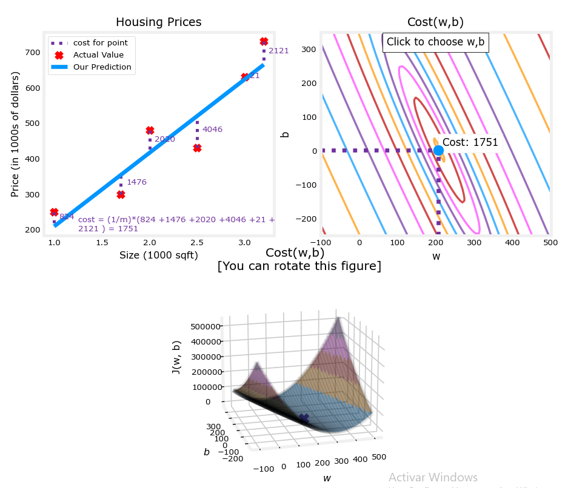

# Supervised Machine Learning Regression and Classification

## Intro to ML

Machine Learning is found in many common applications to recognize different patterns in a certain group of data. This way we can classify data into different groups depending on certain characteristics detected by algorithms.

Multiple problems can be solved by letting the machine learn by itself, since it would a notoriously difficult task to program some complex algorithms for self-driving cars, computer vision, etc.

ML is in itself a subbranch of AI. The road to an Artificial General Intelligence is being paved through AI research and new technologies. An AGI would be a capable intelligent being just as a human is.

### What is Machine Learning?

The more data is fed into a machine there more it can learn about a problem and the closer it can get to mastering a solution.

- Supervised learning: Used the most and with the most advances

- Unsupervised learning

### Intro to Supervised Learning

This type of learning is used when you know exactly what you want to give to the machine $x$ and what you want to get from it $y$. You give the machine examples of input, output pairs. By going through multiple examples the machine learns to predict the $y$ output from a given $x$ inputs.

A **regression** attempts to predict a number from infinitely many possible outputs. For example a linear regression, which fits the prediction between $x$ and $y$ values with a linear relationship. Another is a logarithmic type, which first the data with a logarithmic function.

The regression is visualized as the line of a function $f(x)$ in a scatter plot of $x$ vs $y$.

A **classification** attempts to predict a category between a small amount of possible outputs in order to classify the given input into a group. There can be two main groups each with categories, or many groups, etc., as well as more than one input.

The classification limit can be visualized as the boundary line between both output categories, either 2D for 1 input or 3D for 2 inputs.

Main difference is the number of possible outputs between both algorithms.

### Intro to Unsupervised Learning

This type of learning is used when we do not know the exact labels we want from the algorithm, but instead we want to obtain hidden patterns in the data. These hidden patterns can emerge by **clustering**.

This type of algorithms tries to find structure in a dataset by grouping or segmenting together similar values and thus obtaining different categories based on hidden patterns (hidden because we do not know the $y$ output label desired)

Another type of learning is **anomaly detection**, used to detect unusual events in a certain dataset. By detecting these scattered inputs we can, for example, detect fraud in financial systems.

**Dimensionality reduction** reduces the size of data.

Difference:

Jupyter Notebooks are the exact same tools that many large companies are using to create ML environments. In these one can describe markdown and code cells united into one document. The code cells can be run in any order desired and belong to the same environment (meaning the result of a code block can be reflected in another).

## Linear Regression

It is the most common regression model. It uses a training set, which is the data used to train the model. This data can be represented as two columns with inputs / features and outputs / targets.

Notation:

- $x$: Feature variable, $y$: Target variable

- $m$: Number of training examples (rows)

- $(x^i,y^i)$: ith training example (ith row)

- $w$, $b$: parameters / coefficients adjusted during the training to improve the model. weights and bias

The algorithm will produce a linear function that takes $x$ and produces an estimate to $y$, which is going to be called $\hat{y}$.

$$
\begin{align}
\hat{y}=f_{w,b}(x)=wx+b
\end{align}
$$

> For fixed $w$ and $b$, function of $x$

Through machine learning what we are going to predict are the specific parameters needed for our linear function so that every $y^i$ value is close to every $\hat{y}^i$.

### Lab #1

Matplotlib is used to plot data and numpy is used to do scientific calculations

Create two one-dimensional Numpy arrays which are faster and smaller than a Python list. Inside we put all of the training examples, in one array the $x$ values and in the other the $y$ values. We can obtain their size to obtain $m$.

With pyplot from matplotlib we can plot both arrays.

## Cost / Loss function

To evaluate how close an estimation is to the actual target we obtain the error by obtaining the difference between both values. Through the summation of all the errors we get the total error or cost of the estimations against the targets.

By convention, for a squared cost function, we:

- Divide the cost by $2m$ so the summation doesn't explode with large trainings sets.

- Obtain the squared error since it gives better results for regression models

$$
\begin{align}
J(w,b)=\frac{1}{2m}\sum_{i=1}^m(\hat{y}^{(i)}-y^{(i)})^2
\end{align}
$$

When $f(x)$ fits perfectly each target, then $J(w,b)=0$

$J(w,b)$ is how the cost changes with the slope and intercept, so, 3 variables, represented as either a 3D surface or as a contour plot, which is like a topographic map.

The 3D surface will ressemble a bowl. This surface doesn't because of the specific relationship between the features and its targets, but in the end there will always be a minimum point for the surface. It can be visualized in a 2D space:

The point at which the cost is the least will be the global minimum of the function, and also our desired combination of parameters.

### Lab #2

To perform the calculations required to obtain the linear regression function we can use numpy arrays and methods. Also unpacking of an iterable object via `foo(*list)`.

To plot an interactive space into a Jupyter Notebook we can use the `ipywidgets` library. Using pyplot from matplot lib we can specify multiple properties of a graph, like:

1. `.subplots(nrows, ncols)`: Creates a figure and a set of subplots.
2. `.plot(x, y)`: Plots `y` versus `x`.
3. `.scatter(x, y)`: Creates a scatter plot of `y` versus `x`.
4. `.hlines(y, xmin, xmax)`: Draws horizontal lines at specified y-values.
5. `.vlines(x, ymin, ymax)`: Draws vertical lines at specified x-values.
6. `.set_title(title)`: Sets the title of the subplot.
7. `.set_ylabel(ylabel)`: Sets the label of the y-axis.
8. `.set_xlabel(xlabel)`: Sets the label of the x-axis.
9. `.legend(loc)`: Adds a legend to the subplot.
10. `.show()`: Displays the figure and its subplots.

## Gradient Descent

So, how do we minimize a function like the cost function $J$?

Find the steepest point around a relative location forever until we reach a local minima of the function where we can't longer descend. The starting point will be certain values $b$ and $w$. By convention we start the gradient descend at $(0,0)$.  Different starting points can lead to different ending values when there is more than one local minima.

$$
\begin{align}
w=w-\alpha\frac{d}{dw}J(w,b)
\end{align}
$$

$$
\begin{align}
b=b-\alpha\frac{d}{db}J(w,b)
\end{align}
$$

- $\alpha$ is the magnitude of the step or learning rate
  
  - If it small, the process will be slower but more precise
  
  - If it is big, we might overshoot the minimum and never reach it.

- The derivative is the direction to which we "go down the hill".
  
  - If the rate of change is positive, decrease $w$, else, increase it.
  
  - The term is negative because negative slopes update the variable forward and positive slopes update it backwards, towards a minimum. If it were the opposite, we would be shooting to a maximum.

Both equations must be simultaneously updated. We repeat the update until both values converge (where the derivative is really really small that the term is cancelled and we end up with $w=w$ and $b=b$  ).

Considering:

$$
\begin{align}
\frac{\partial J(w,b)}{\partial w}  &= \frac{1}{m} \sum\limits_{i = 0}^{m-1} (f_{w,b}(x^{(i)}) - y^{(i)})x^{(i)}
\end{align}
$$

$$
\begin{align}
  \frac{\partial J(w,b)}{\partial b}  &= \frac{1}{m} \sum\limits_{i = 0}^{m-1} (f_{w,b}(x^{(i)}) - y^{(i)})
\end{align}
$$

the final big equations extending $\frac{d}{dw}J(w,b)$, look like:

$$
\begin{align}
w^{(j+1)}=w^{(j)}-\alpha\frac{1}{m} \sum\limits_{i = 0}^{m-1} (f_{w,b}(x^{(i)}) - y^{(i)})x^{(i)}
\end{align}
$$

$$
\begin{align}
b^{(j+1)}=b^{(j)}-\alpha\frac{1}{m} \sum\limits_{i = 0}^{m-1} (f_{w,b}(x^{(i)}) - y^{(i)})
\end{align}
$$

## Lab #3

Because this is batch gradient descent (always taking into account all the training set for $f(w,b)$, to compute it we have to use two main loops:

- $i$: To compute the summatory of all the costs and thus get the total cost for the specific $(w,b)$ pair, and then compute its corresponding derivative.

- $j$: To compute each gradient until we end of the gradient descent

First loop is a function on its own,

`compute_gradient(x,y,w,b) -> (dJ_dw, dJ_db)`,

to calculate the partial derivative (or gradient) which includes the cost summatory, and the second,

`gradient_descent(x,y,w_in,b_in,alpha,*helper_functions) -> (fin_w,fin_b)`, 

is another that will call the first to add the step as many times as needed to get to the minima.

The last function can be stopped with a convergence threshold value `epsilon` (when $w$ and $b$ are unchanged when the gradient becomes really small because we are really close to the minima) or with a set `num_iters`. We combine both to instead define a `max_iters` value when the defined threshold can't be met.

With a squared cost function, as we come closer to the minima the gradient becomes smaller, and thus we start taking smaller steps to the end. This is because in a cuadratic function we go from steep rates of change to flat ones as we approach a derivative with value 0.
