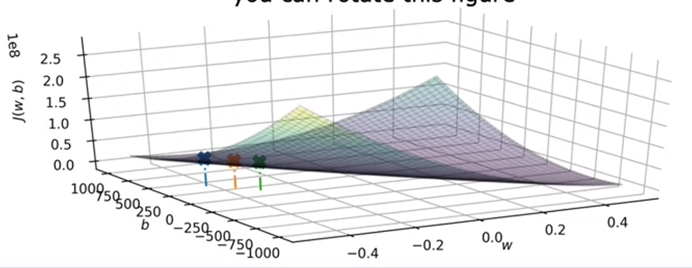
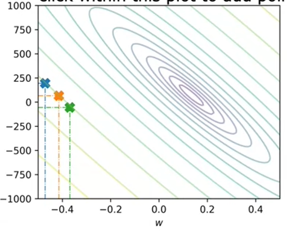

# Supervised Machine Learning Regression and Classification

## Intro to ML

Machine Learning is found in many common applications to recognize different patterns in a certain group of data. This way we can classify data into different groups depending on certain characteristics detected by algorithms.

Multiple problems can be solved by letting the machine learn by itself, since it would a notoriously difficult task to program some complex algorithms for self-driving cars, computer vision, etc.

ML is in itself a subbranch of AI. The road to an Artificial General Intelligence is being paved through AI research and new technologies. An AGI would be a capable intelligent being just as a human is.

### What is Machine Learning?

The more data is fed into a machine there more it can learn about a problem and the closer it can get to mastering a solution.

- Supervised learning: Used the most and with the most advances

- Unsupervised learning

### Intro to Supervised Learning

This type of learning is used when you know exactly what you want to give to the machine $x$ and what you want to get from it $y$. You give the machine examples of input, output pairs. By going through multiple examples the machine learns to predict the $y$ output from a given $x$ inputs.

A **regression** attempts to predict a number from infinitely many possible outputs. For example a linear regression, which fits the prediction between $x$ and $y$ values with a linear relationship. Another is a logarithmic type, which first the data with a logarithmic function.

The regression is visualized as the line of a function $f(x)$ in a scatter plot of $x$ vs $y$.

A **classification** attempts to predict a category between a small amount of possible outputs in order to classify the given input into a group. There can be two main groups each with categories, or many groups, etc., as well as more than one input.

The classification limit can be visualized as the boundary line between both output categories, either 2D for 1 input or 3D for 2 inputs.

Main difference is the number of possible outputs between both algorithms.

### Intro to Unsupervised Learning

This type of learning is used when we do not know the exact labels we want from the algorithm, but instead we want to obtain hidden patterns in the data. These hidden patterns can emerge by **clustering**.

This type of algorithms tries to find structure in a dataset by grouping or segmenting together similar values and thus obtaining different categories based on hidden patterns (hidden because we do not know the $y$ output label desired)

Another type of learning is **anomaly detection**, used to detect unusual events in a certain dataset. By detecting these scattered inputs we can, for example, detect fraud in financial systems.

**Dimensionality reduction** reduces the size of data.

Difference:

Jupyter Notebooks are the exact same tools that many large companies are using to create ML environments. In these one can describe markdown and code cells united into one document. The code cells can be run in any order desired and belong to the same environment (meaning the result of a code block can be reflected in another).

## Linear Regression

It is the most common regression model. It uses a training set, which is the data used to train the model. This data can be represented as two columns with inputs / features and outputs / targets.

Notation:

- $x$: Feature variable, $y$: Target variable

- $m$: Number of training examples (rows)

- $(x^i,y^i)$: ith training example (ith row)

- $w$, $b$: parameters / coefficients adjusted during the training to improve the model

The algorithm will produce a linear function that takes $x$ and produces an estimate to $y$, which is going to be called $\hat{y}$.

$$
\hat{y}=f_{w,b}(x)=wx+b
$$

> For fixed $w$ and $b$, function of $x$

Through machine learning what we are going to predict are the specific parameters needed for our linear function so that every $y^i$ value is close to every $\hat{y}^i$.

### Lab #1

Matplotlib is used to plot data and numpy is used to do scientific calculations

Create two one-dimensional Numpy arrays which are faster and smaller than a Python list. Inside we put all of the training examples, in one array the $x$ values and in the other the $y$ values. We can obtain their its size to obtain $m$.

With pyplot from matplotlib we can plot both arrays.

## Squared Cost function

To evaluate how close an estimation is to the actual target we obtain the error by obtaining the difference between both values. Through the summation of all the errors we get the total error or cost of the estimations against the targets.

By convention, we:

- Divide the cost by $2m$ so the summation doesn't explode with large trainings sets.

- Obtain the squared error since it gives better results for regression models

$$
J(w,b)=\frac{1}2m{}\sum_{i=1}^m(\hat{y}^{(i)}-y^{(i)})^2
$$

When $f(x)$ fits perfectly each target, then $J(w,b)=0$

$J(w,b)$ is how the cost changes with the slope and intercept, so, 3 variables, represented as either a 3D surface or as a contour plot, which is like a topographic map.

The point at which the cost is the least will be our desired combination of parameters. To obtain it, we can obtain the global minimum point of the function.
