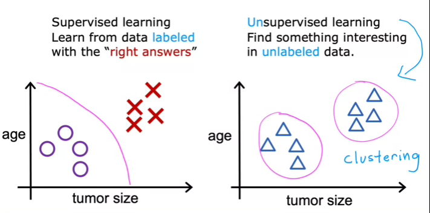

# Supervised Machine Learning Regression and Classification

## Intro to ML

Machine Learning is found in many common applications to recognize different patterns in a certain group of data. This way we can classify data into different groups depending on certain characteristics detected by algorithms.

Multiple problems can be solved by letting the machine learn by itself, since it would a notoriously difficult task to program some complex algorithms for self-driving cars, computer vision, etc.

ML is in itself a subbranch of AI. The road to an Artificial General Intelligence is being paved through AI research and new technologies. An AGI would be a capable intelligent being just as a human is.

## What is Machine Learning?

The more data is feeded into a machine there more it can learn about a problem and the closer it can get to mastering a solution.

- Supervised learning: Used the most and with the most advances

- Unsupervised learning

## Intro to Supervised Learning

This type of learning is used when you know exactly what you want to give to the machine $x$ and what you want to get from it $y$. You give the machine examples of input, output pairs. By going through multiple examples the machine learns to predict the $y$ output from a given $x$ inputs.

A **regression** attempts to predict a number from infinitely many possible outputs. For example a linear regression, which fits the prediction between $x$ and $y$ values with a linear relationship. Another is a logarithmic type, which fitst the data with a logarithmic function.

The regression is visualized as the line of a function $f(x)$ in a scatter plot of $x$ vs $y$.

A **classification** attempts to predict a category between a small amount of possible outputs in order to classify the given input into a group. There can be two main groups each with categories, or many groups, etc., as well as more than one input.

The classification limit can be visualized as the boundary line between both output categories, either 2D for 1 input or 3D for 2 inputs.

Main difference is the number of possible outputs between both algorithms.

## Intro to Unsupervised Learning

This type of learning is used when we do not know the exact labels we want from the algorithm, but instead we want to obtain hidden paterns in the data. These hidden patterns can emerge by **clustering**.

This type of algorithms try to find structure in a dataset by grouping or segmentating together similar values and thus obtaining different categories based on hidden patterns (hidden because we do not know the $y$ output label desired)

Another type of learning is **anomaly detection**, used to detect unusual events in a certain dataset. By detecting these scattered inputs we can, for example, detect fraud in financial systems.

**Dimensionality reduction** reduces the size of data.

Difference:

## Jupyter Notebooks

The exact same tool that many large companies are using to create ML environments.

